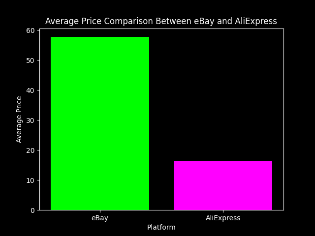
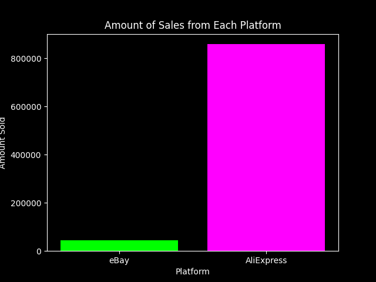
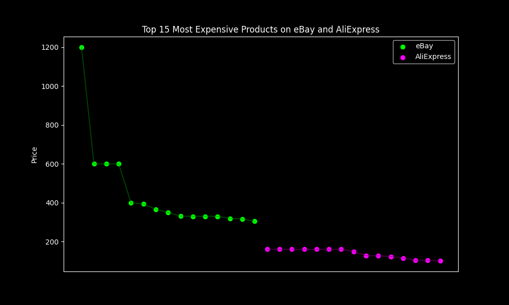
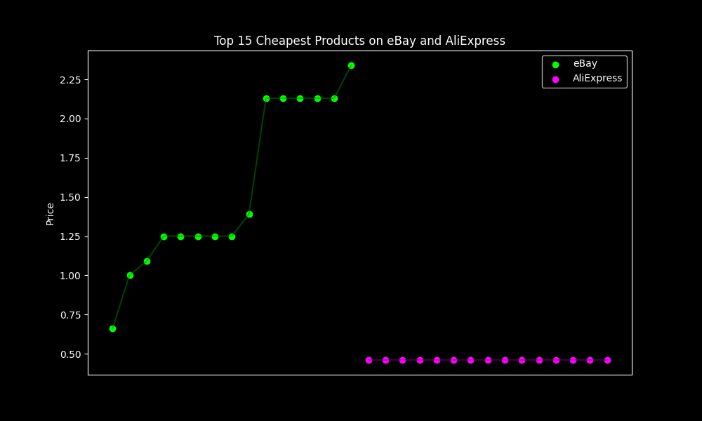
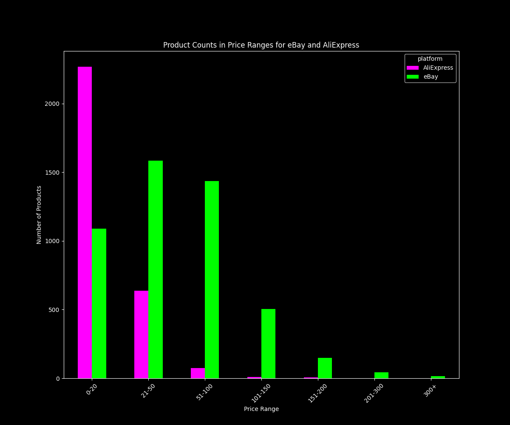

# Analyzing Womens Shoes from AliExpress and eBay

## Introduction
This project involves analyzing women's shoe data from two different online platforms: eBay and AliExpress. The analysis is aimed at understanding the pricing strategies and popular price ranges of women's shoes on these platforms. The project is divided into three main Python scripts, each handling a different aspect of the data analysis.

## Files Description
- `aliExpress.py`: Python script for processing and analyzing data from the AliExpress platform.
- `ebay.py`: Python script for processing and analyzing data from the eBay platform.
- `analyzingWomensShoes.py`: Main Python script that integrates data from both platforms to provide comprehensive insights.
- `aliExpress.csv`: Contains the dataset from the AliExpress platform.
- `ebay.csv`: Contains the dataset from the eBay platform.
- `requirements.txt`: Lists all the Python dependencies required for the project.

## Installation
To run this project, Python 3.x is required. To install the necessary dependencies, run the following command in your terminal:
pip install -r requirements.txt

## Usage
Run the scripts in the following order to perform a complete analysis:
1. `aliExpress.py`
2. `ebay.py`
3. `analyzingWomensShoes.py`

Each script can be executed with the following command:
python <script_name>.py

Replace `<script_name>` with the name of the script you want to run.

## Data Analysis Overview
- **AliExpress Data Analysis (`aliExpress.py`)**: This script processes the `aliExpress.csv` file, focusing on the analysis of product prices and other relevant attributes from the AliExpress platform.
- **eBay Data Analysis (`ebay.py`)**: Similar to `aliExpress.py`, this script is dedicated to analyzing data from `ebay.csv`, offering insights into the pricing and product range on eBay.
- **Comparative Analysis (`analyzingWomensShoes.py`)**: This script brings together data from both platforms, providing a comparative analysis of price trends, popular price ranges, and other significant metrics.

## Data Analysis Insights

This project was made with 5 tasks in mind:

### Task 1: Average price Comparison Between eBay and AliExpress
The goal of this task was to see which platform had the cheapest products on average.
As we can see AliExpress has much cheaper products.

### Task 2: Amount of Sales from Each Platform
Since AliExpress had cheaper products, the goal of this task was to compare the sales of each platform.
As we can see AliExpress has a lot more sales. 
It should also be noted that the data might not be entirely accurate since the majority of products on eBay did not have information about sales.

### Task 3: Top 15 Most Expensive Products on eBay and AliExpress
The goal of this task was to check which platform had the most expensive products.
As we can see eBay had the more expensive womens shoes.

### Task 4: Top 15 Cheapest Products on eBay and AliExpress
Since we knew which platform had the most expensive products, the goal of the following task
was to chech which platform had the cheapest products.
As we can see it is AliExpress.

### Task 5: Product Counts in Price Ranges for eBay and AliExpress
The goal of this task was to see which price range is most popular in these platforms.
As we can see the price range that is most popular in AliExpress is 0-20 Eur
and in eBay: 21-50 Eur.

